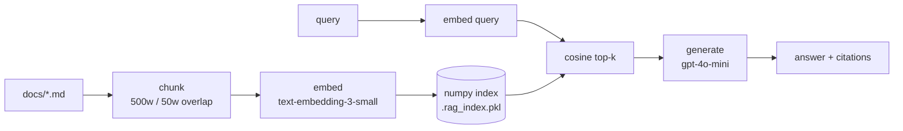

# rag-in-100-lines

> *A complete Retrieval-Augmented Generation engine in one Python file. No vector database. No framework. No magic.*


<p align="left">
  <a href="https://github.com/krish9219/rag-in-100-lines/stargazers"></a>
  <a href="https://github.com/krish9219/rag-in-100-lines/blob/main/LICENSE"></a>
  
  
  
  <a href="https://github.com/krish9219/rag-in-100-lines/actions"></a>
</p>

Most RAG tutorials reach for LangChain, LlamaIndex, Pinecone, and three layers of abstraction before retrieving a single chunk. The actual algorithm is small. This repo is the algorithm, end-to-end, in 93 readable lines of Python — and a reading guide for everything around it.

> **Read the source first, the docs second.** [`rag.py`](rag.py) is 93 lines. The whole pipeline fits on one screen.

## Table of contents

- [Quick start](#quick-start)
- [How it works](#how-it-works)
- [Example output](#example-output)
- [What's actually in here](#whats-actually-in-here)
- [vs. the alternatives](#vs-the-alternatives)
- [FAQ](#faq)
- [When to use this vs a real framework](#when-to-use-this-vs-a-real-framework)
- [Reading order](#reading-order)
- [Tests](#tests)
- [Contributing](#contributing)
- [License](#license)

## Quick start

```bash
git clone https://github.com/krish9219/rag-in-100-lines
cd rag-in-100-lines
pip install -r requirements.txt
export OPENAI_API_KEY=sk-...

python rag.py "What is RAG and why does it matter?"
```

The first run embeds the sample docs in `docs/` and caches an index to `.rag_index.pkl`. Subsequent runs are instant.

## How it works



Five stages, in this order, no exceptions:

1. **Chunk** — split each doc on whitespace, sliding window of 500 words with 50-word overlap.
2. **Embed** — call OpenAI `text-embedding-3-small` once per chunk. Normalize vectors so cosine = dot product.
3. **Index** — stack vectors into a `(N, 1536)` numpy array. Pickle alongside the chunks.
4. **Retrieve** — embed the query, dot-product against the matrix, take top-k.
5. **Generate** — concatenate hits as numbered context, instruct `gpt-4o-mini` to cite by number.

Every "fancy" RAG framework is variations on these five steps. Add a reranker between 4 and 5, swap numpy for Qdrant in step 3, add query rewriting before step 4 — that's it.

## Example output

```bash
$ python rag.py "How should I chunk documents in production?"
```

```json
{
  "answer": "In production, naive whitespace splitting destroys structure. Better options are semantic chunking (split on paragraph boundaries, then merge until a token budget is reached), markdown-aware chunking (never split inside a code block or table row), and a sliding window with 50-100 token overlap [1]. Tools like Ragas help validate that retrieval hit rate doesn't regress when you change chunking strategy [2].",
  "sources": [
    {"source": "docs/production.md",     "preview": "Naive whitespace splitting destroys structure..."},
    {"source": "docs/rag-explained.md",  "preview": "Chunk - split source documents into bite-size passages..."}
  ]
}
```

For an interactive REPL:

```bash
python chat.py
```

## What's actually in here

| File | Lines | Purpose |
|---|---|---|
| [`rag.py`](rag.py) | 93 | The whole engine: chunk, embed, index, retrieve, generate |
| [`chat.py`](chat.py) | 25 | Interactive REPL |
| [`test_rag.py`](test_rag.py) | 45 | Offline tests - no API calls, no spend |
| [`docs/*.md`](docs/) | - | Sample knowledge base for the demo |

## vs. the alternatives

| | rag-in-100-lines | LangChain RAG | LlamaIndex | Haystack |
|---|---|---|---|---|
| **Lines of code to grok** | 93 | ~thousands | ~thousands | ~thousands |
| **Dependencies** | 2 (`openai`, `numpy`) | 30+ | 25+ | 20+ |
| **Vector store** | numpy + pickle | pluggable | pluggable | pluggable |
| **Hidden retries / fallbacks** | none | many | many | many |
| **Time to first answer** | ~30s incl. install | ~5min | ~5min | ~10min |
| **Production-ready?** | for small corpora | yes | yes | yes |
| **Pedagogical value** | high | low | low | low |

These frameworks are *fine choices for production*. They are *terrible choices for understanding* - they obscure the algorithm behind abstractions you'd have to remove before learning anything.

## FAQ

**Why pickle for the index?** Because the corpus is small. For >100k chunks, swap `pickle` for `faiss.IndexFlatIP` or `qdrant-client`. It's a one-function change.

**Why OpenAI and not a local model?** Because `text-embedding-3-small` is the pragmatic default - 1536 dim, fast, cheap, broadly understood. To swap, change one function (`embed()`) to call `sentence_transformers` or Cohere.

**Why not async?** Because batched `OpenAI.embeddings.create([...])` already batches in one request. Async wins only when you're embedding from many sources concurrently.

**Why no reranker?** Because the goal is the 100-line core. The reading guide in [`docs/production.md`](docs/production.md) explains when and how to add one.

**Can I use this in production?** For under ~50k chunks and one user at a time: yes. Beyond that you need ANN search, concurrency, and observability that this repo intentionally lacks.

**Where's the GUI?** There isn't one. Build it as a 60-line Next.js page; the API is `rag.ask(query)`.

## When to use this vs a real framework

**Use this when** you want to understand how RAG works, you have under ~100k chunks, you're prototyping and don't want to fight LangChain, or you're teaching RAG to someone else.

**Use a real framework when** you need ANN search, sharding, hybrid retrieval, or reranking out of the box; when you're integrating 10+ data sources; or when you need observability hooks for production.

## Reading order

1. [`docs/rag-explained.md`](docs/rag-explained.md) - the concept.
2. [`rag.py`](rag.py) top to bottom. Each function is one stage.
3. `python test_rag.py` - run the suite.
4. [`docs/embeddings.md`](docs/embeddings.md) - the math.
5. [`docs/production.md`](docs/production.md) - what changes at scale.
6. Modify `CHUNK_SIZE`, `TOP_K`, or the system prompt. Notice what breaks.

## Tests

```bash
python test_rag.py
```

Tests cover chunking and retrieval ranking without spending API credits. CI runs them on every PR - see [`.github/workflows/ci.yml`](.github/workflows/ci.yml).

## Contributing

Issues and PRs welcome - see [CONTRIBUTING.md](CONTRIBUTING.md). The 100-line constraint is a feature; PRs that grow `rag.py` past 100 lines need to make a strong case.

Security concerns: see [SECURITY.md](SECURITY.md).

## Star history

If this repo saved you an afternoon, star it - it's the cheapest way to say thanks and helps others find it.

[](https://star-history.com/#krish9219/rag-in-100-lines&Date)

## License

MIT - see [LICENSE](LICENSE).
